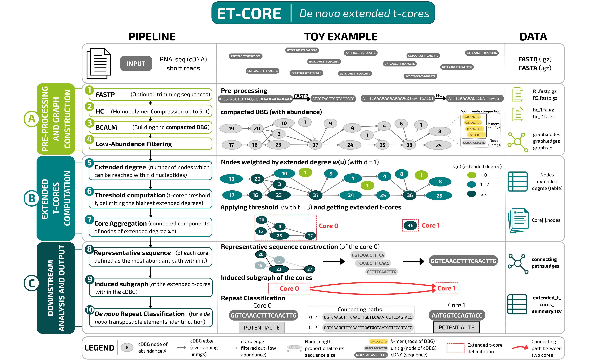

# ET-core

This repository contains the code for **ET-core**, a tool designed for the _de novo_ computation of **extended-t-cores** from 
compacted de Bruijn graphs built using short-read RNA-seq data.

The **extended-t-cores** conceptually correspond to the dense regions 
of the compacted de Bruijn graph due to the presence of inexact repeated sequences. 
They are defined as the maximal connected subgraphs of the compacted de Bruijn graph where all the
unitigs have a high extended degree. While the degree is bounded by the size of the alphabet (4 for DNA/RNA),
the extended degree generalises this notion and corresponds to the number of nodes which can be reached at 
a given distance (by default d=10). 
In transcriptomics, it represents the number of locally distinct transcripts containing the sequence of the unitig.


There are two ways to run **ET-core**: using the provided by **cloning this repository** or **Docker image**. 
While the source code version requires installing dependencies, it includes a small example dataset and scripts for
reproducibility. 
Please refer to the relevant section below based on your choice.

## ET-core from the Git clone

First, clone the git project:

```
git clone https://github.com/sdarmon/ET-core
cd ET-core
```

### Dependencies and versions used (for optimal execution)

Check or install those following dependencies.

- **Python** version 3.11.2, with **pip** (version 23.0.1) to install :
    * numpy (version 2.3.1)
    * pysam (version 0.23.0)
- **Cargo** version 1.75.0 (for Rust compilation)
- **gcc** version 12.2.0 (for C++ compilation)
- **libomp-dev** version 1:18.0 (for C++ parallelisation)
- **BCALM 2** version 2.2.3, git commit cf371b6 (include gatb-core version 1.4.2)
- **Optional : FastP** version 0.23.4 (by default, run FastP on the reads. Use the `--no-fastp` option if you do NOT want to use FastP)
- **Optional : seqtk** version 1.4-r122 (for sampling the reads using the `--sample` option)


For each `<package>` ou `<xyz>` python3 package, you can use the following commands :
```
sudo apt install <package>
sudo apt install python3-<xyz> for `<xyz>` python3 package
```
### Code example (with dependencies built)

To execute the code, simply run the following command in the terminal:
```
bash ET-core.sh \
    --reads1 reads_1.fastq[.gz] \
    --reads2 reads_2.fastq[.gz] \
    -O output_dir
```
Where `reads_1.fastq[.gz]` and `reads_2.fastq[.gz]` are the paths to the paired-end reads, possibly `.gz`, and 
where `output_dir` is the output directory.

Some additional parameters can be specified:
- `-p`: number of threads to use (default: 8)
- `-k`: k-mer size to use for the DBG construction (default: 41)
- `-d`: extended degree distance to use for the weighting of the nodes (default: 10)
- `-h`: hamming distance to use for the weighting of the nodes (default: 2)
- `-t`: threshold to use for the agglomeration of the nodes (default: 'precise'; options : 'sensitive' | 'precise' | t where t is a integer greater than 1)
- `-a`: minimal abundance required to index the k-mers (default: 2)
- `--max-memory`: max memory to use (in MBytes, default: 14000)
- `--no-fastp` : do not run fastp on the reads (not recommended if the reads are not curated)
- `--sample` : subsample the reads (default: no sampling; options : n (number of reads) | f (sample fraction, between 0 and 1))


## ET-core from a docker image

First check if docker is installed on your machine.

If `docker ps` raises an error, you should add `sudo` to the following docker commands.

### Download the image
```
docker pull sdarmon/et-core:1.0
```
### Execution of ET-core using docker
```
docker run --rm \
    -v /absolute/path/to/your/reads/directory:/data \
    -v /absolute/path/to/your/output/directory:/output \
    sdarmon/et-core:1.0 \
    --reads1 /data/reads_1.fastq[.gz] \
    --reads2 /data/reads_2.fastq[.gz] \
    -O /output
```

Where `reads_1.fastq[.gz]` and `reads_2.fastq[.gz]` are the paired-end reads, possibly `.gz`.

Some additional parameters can be specified:
- `-p`: number of threads to use (default: 8)
- `-k`: k-mer size to use for the DBG construction (default: 41)
- `-d`: extended degree distance to use for the weighting of the nodes (default: 10)
- `-h`: hamming distance to use for the weighting of the nodes (default: 2)
- `-t`: threshold to use for the agglomeration of the nodes (default: 'precise'; options : 'sensitive' | 'precise' | t where t is a integer greater than 1)
- `-a`: minimal abundance required to index the k-mers (default: 2)
- `--max-memory`: max memory to use (in MBytes, default: 14000)
- `--no-fastp` : do not run fastp on the reads (not recommended if the reads are not curated)
- `--sample` : subsample the reads (default: no sampling; options : n (number of reads) | f (sample fraction, between 0 and 1))


### Pipeline overview



### Output and files structure

The central file is `extended_t_cores_summary.tsv`. It contains the summary of every the extended-t-cores with the 
following columns:

*The first four headers characterize the cores. The other four headers provide additional important metrics for the cores.*

| Column Header | Description | Format/Units |
| :--- | :--- | :--- |
| **`Id`** | Unique identifier for the extended $t$-core, sorted by decreasing `Max_degree`. | Integer |
| **`Representative`** | Most abundant sequence of the extended $t$-core. | DNA string |
| **`Repeat_type`** | Repeat classification based on the DNA sequences of the extended $t$-core: Microsatellite (% covered), A/T or C/G stretch $(X)^{\geq 5}$. Other cases are labeled as Potential TE. | String |
| **`TE_Score`** | Confidence score for Transposable Element classification. | `0` (Low) – `3` (High) |
| **`Max_degree`** | Highest extended degree for a node within the core. | Integer |
| **`Max_abundance`** | Highest number of reads mapped to a node of the extended $t$-core. | Float |
| **`Core_connectivity`** | Number of paths connecting other extended $t$-cores to that core. | Integer |
| **`Primary_neighbour`** | ID of the neighbour having the highest number of distinct paths connecting both cores, and percentage of such connecting paths. | ID:Percentage (%) |

