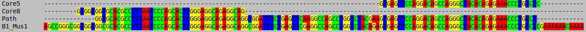

## Transposable Elements analysis - Reproducibility

To reproduce the results of the article on the *Mus musculus* dataset, you can download the paired-end reads from the 
SRA project ERR2680378, and the TE consensus sequences from the **DFAM** database (see last section for TEs extraction 
explanation).


Here, we present a small reproducibility example, based on a subset of the full dataset of the SRA project ERR2680378.
In this example, we sampled 100,000 RNA-seq pair-ended reads and we took the TE consensus sequences from the **DFAM**
database (downloaded on march 2026).  astP was already used on those sampled reads for detecting and removing adapters,
and for removing polyX tails. All of those files are available in the `Mus_musculus_small_example` directory of 
this repository.

### Dependencies and versions used

- **Python** version 3.11.2, with **pip** v. 23.0.1 to install :
    * numpy (version 2.3.1)
    * pysam (version 0.23.0)
- **Cargo** version 1.75.0 (for Rust compilation)
- **gcc** version 12.2.0 (for C++ compilation)
- **BCALM 2** version v2.2.3, git commit cf371b6 (Using gatb-core version 1.4.2)

### ET-core execution

In the remaining of this reproducibility example, we will compute and analyse the extended-t-cores of the 
100,000 reads sample. we run the `extended-t-core.sh` script on the reads to compute the extended-t-cores. 
The option `--no-fastp` is used here because the reads are already curated with FastP. 
To reproduce the results of the article on the full dataset,
you should not use the `--no-fastp` option to automatically run FastP on the reads. 

```
bash extended-t-core.sh \
    --reads1 Mus_musculus_small_example/R1.fastp.gz \
    --reads2 Mus_musculus_small_example/R2.fastp.gz \
    -O Mus_musculus_small_example/ \
    --no-fastp
```


In the end, 12 cores should be found and summarised within the `Mus_musculus_small_example/results/extended_t_cores_summary.tsv` file.
It should look like this (order of cores may differ and unitigs might be reverse complemented) :

| Id | Representative | Repeat_type | TE_Score | Max_extended_degree | Max_abundance | Core_connectivity | Best_neighbour |
|---:|:---|:---|:---|---:|---:|---:|:---|
| 0 | `GGGGCTGGTGAGATGGCTCAGTGGGTAAGAGCACCCGACTGCTCTTCC` | Potential TE | 2 | 10 | 20.5 | 2 | 7:100.0% |
| 1 | `TTCCTTCCTTCCTTCCTTCCTTCCTTCCTTCCTTCCTTCCTT` | Microsat AGGA (91%) | 0 | 7 | 77.0 | 0 | . |
| 2 | `GTGTGTGTGTGTGTGTGTGTGAGAGAGAGAGAGAGAGAGAGAGAG` | Microsat CT (97%) | 0 | 6 | 6.0 | 0 | . |
| 3 | `GTTTTGTTTTGTTTTGTTTTGTTTTGTTTTGTTTTGTTTTGTTTT` | Microsat AAACA (86%) | 0 | 6 | 8.0 | 0 | . |
| 4 | `AAGGAAAGGAAAGGAAAGGAAAGGAAAGGAAAGGAAAGGAAAGGATTCCTTTCCTTT` | Microsat CCTTT (92%) | 0 | 6 | 48.0 | 0 | . |
| 5 | `GTGAGTTCCAGGACAGCCAGGGCTACACAGAGAAACCCTGTCTC` | Potential TE | 3 | 6 | 36.0 | 17 | 8:100.0% |
| 6 | `GTGGTGGCGCACGCCTTTAATCCCAGCACTTGGGAGGCAGAG` | Potential TE | 1 | 5 | 15.0 | 0 | . |
| 7 | `CATGTGGTTGCTGGGATTTGAACTCAGGACCTTTGGAAGAGCAGTC` | Potential TE | 2 | 5 | 10.2 | 2 | 0:100.0% |
| 8 | `GTGGTGGTGCACGCCTTTAATCCCAGCACTTGGGAGGCAGAGGCAG` | Potential TE | 3 | 5 | 11.0 | 17 | 5:100.0% |
| 9 | `AGCCCCGGCTTCTCGAGGCCTGTCTACACTCGCTGCTTTCCTTCCTCACCTCCAATTTCCCCTCCAACCCACTGCTTCCTGACTCGCTCTTCTCCATCGAACGGCTCTCGCTCAGG` | Potential TE | 1 | 5 | 13.9 | 0 | . |
| 10 | `GCTGGGGTTTACCTCATGGATAAAGATGTCCAACAGGGAGGGGCCAAATGTTCCCACCACCTCCTGGCACTTGGTTCTGGCAGGATCGGGGAGCAGTGCGCATGCGTTGCTCAAACCTTTAACTAGGAGCTCCTCAGTGGCATTATTGACAATCAGCTCAGAAAACTTATTCATCACAAACTGACAGGTCTGGCATAAAATCACATTGTGGGCCTGGACCAGATTCTGCTCATAGGGGTCCATCATCTCCAGGGCAGGGAGGATGTTCTTAATGGTCTCGGTGGCAGGGACCAGAGTCTTCATTGGCACTCTCTTGACCTCATTACAGAAGCCAGCCAGCACACAGATTTCCTTGGGTTGC` | Potential TE | 1 | 5 | 14.0 | 0 | . |
| 11 | `GATGGATAGATAGATAGATAGATAGATAGATAGATAGATAGATA` | Microsat TATC (89%) | 0 | 5 | 7.0 | 0 | . |


### Cores interpretation

On this example, 7 cores are classified as potential TEs, and 5 cores are classified as microsatellites. We 
can observe that the cores 5 and 8 are the best neighbours of each other with 100% of connectivity. 
That means that cores 5 and 8 only share paths between them. This is due to the fact that they are 
the borders of the *B1_Mus1* TE family, which is one of the most abundant TE family in this dataset.

We can align the representative sequences of the cores 5 and 8 to **Path**, one of the path between them, and to 
the *B1_Mus1* TE consensus sequence, to confirm that those cores are indeed the borders of this TE family. 
Here is such alignment using **Seaview** :



## TE analysis execution

In order to reproduce our validation of the TE prediction, we added an additional script `reproducibility/te_analysis.sh`
that will align the reads and the unitigs on the TE consensus. This script will also compute the TE count for each TE 
family, and save the ROC curves for the TE prediction by the extended-t-cores. More importantly, it will create the
file `extended_t_cores_summary_SOLUTION.tsv` (in the  `Mus_musculus_small_example/results/` directory) which contains 
the summary of the extended-t-cores, with two additional columns : the TE family they align to (if any) and the TE 
count for this family.

### Additional dependency and versions used 

- **Python** version 3.11.2, with **pip** v. 23.0.1 to install :
    * h5py (version 3.13, for using the TE library)
    * matplotlib (version 3.10.7, for plotting the ROC curve)
- **Bowtie2** version 2.2.4
- **Samtools** version 1.9
- **TECount** version 1.0.0 (from the **TEtools** package)
- **featureCounts** version 2.1.1
- **Bedtools** version 2.31.1

### Te analysis execution 

```
bash te_analysis.sh \
    --te-cons dfam_mus_march2026.fa \
    -O Mus_musculus_small_example/
```

### Quick recap of the steps of this code

1. Build the TE library from the **DFAM** database for **Bowtie2** alignment.
2. Align the reads to the TE library using **Bowtie2** and keep only the primary alignments.
3. Align every extended-t-core to the TE library using **Bowtie2** and keep only the primary alignments.
4. Annotate the extended-t-cores with the TE family they align to.
5. Align all the unitigs to the TE library using **Bowtie2** and keep only the primary alignments.
6. Annotate all the unitigs with the TE family they align to.
7. Compute the TE count for each TE family using **TECount**.
8. Compute the TE not covered by the extended-t-cores.
9. Save ROC curves for the TE prediction by the extended-t-cores.
10. Save the summary of the extended-t-cores with their TE annotation and TE count in the `extended_t_cores_summary_SOLUTION.tsv` file.

### Output and files structure

The output directory will have the following additional files and directories:

    OUTDIR/
    └── results/
       ├── extended_t_cores_summary_SOLUTION.tsv 
       ├── TE_coverage_count_ab_filtered.txt       
       ├── output_roc_curves.png                   
       │
       ├── alignment/
       │   ├── READS_sorted.bam (sorted and indexed, only primary)
       │   └── bowtie2_output_reads.txt
       │
       └── cores/
           ├── alignment_all_unitigs.bam
           ├── all_unitigs_annotated.nodes
           ├── core${i}_annotated.nodes
           └── alignment_${i}/
               └── core${i}_aligned.bam (sorted and indexed, only primary)


### Interpretation of the results
The `Mus_musculus_small_example/results/extended_t_cores_summary_SOLUTION.tsv` file should
look like this (order of cores may differ and unitigs might be reverse complemented) :

| Id | Representative | Repeat_type | TE_Score | Max_extended_degree | Max_abundance | Core_connectivity | Best_neighbour | Nb_TEs | TE_list |
|---:|:---|:---|---:|---:|---:|---:|:---|---:|:---|
| 0 | `GGGGCTGGTGAGATGGCTCAGTGGGTAAGAGCACCCGACTGCTCTTCC` | Potential TE | 2 | 10 | 20.5 | 2 | 7:100.0% | 1 | B2_Mm1a; |
| 1 | `TTCCTTCCTTCCTTCCTTCCTTCCTTCCTTCCTTCCTTCCTT` | Microsat AGGA (91%) | 0 | 7 | 77.0 | 0 | . | 0 | |
| 2 | `GTGTGTGTGTGTGTGTGTGTGAGAGAGAGAGAGAGAGAGAGAGAG` | Microsat CT (97%) | 0 | 6 | 6.0 | 0 | . | 0 | |
| 3 | `GTTTTGTTTTGTTTTGTTTTGTTTTGTTTTGTTTTGTTTTGTTTT` | Microsat AAACA (86%) | 0 | 6 | 8.0 | 0 | . | 0 | |
| 4 | `AAGGAAAGGAAAGGAAAGGAAAGGAAAGGAAAGGAAAGGAAAGGATTCCTTTCCTTT` | Microsat CCTTT (92%) | 0 | 6 | 48.0 | 0 | . | 0 | |
| 5 | `GTGAGTTCCAGGACAGCCAGGGCTACACAGAGAAACCCTGTCTC` | Potential TE | 3 | 6 | 36.0 | 17 | 8:100.0% | 4 | B1_Mur3; B1_Mur4; B1_Mus1; B1_Mus2; |
| 6 | `GTGGTGGCGCACGCCTTTAATCCCAGCACTTGGGAGGCAGAG` | Potential TE | 1 | 5 | 15.0 | 0 | . | 1 | B1_Mus1; |
| 7 | `CATGTGGTTGCTGGGATTTGAACTCAGGACCTTTGGAAGAGCAGTC` | Potential TE | 2 | 5 | 10.2 | 2 | 0:100.0% | 1 | B2_Mm1t; |
| 8 | `GTGGTGGTGCACGCCTTTAATCCCAGCACTTGGGAGGCAGAGGCAG` | Potential TE | 3 | 5 | 11.0 | 17 | 5:100.0% | 1 | B1_Mus1; |
| 9 | `AGCCCCGGCTTCTCGAGGCCTGTCTACACTCGCTGCTTTCCTTCCTCACCTCCAATTTCCCCTCCAACCCACTGCTTCCTGACTCGCTCTTCTCCATCGAACGGCTCTCGCTCAGG` | Potential TE | 1 | 5 | 13.9 | 0 | . | 0 | |
| 10 | `GCTGGGGTTTACCTCATGGATAAAGATGTCCAACAGGGAGGGGCCAAATGTTCCCACCACCTCCTGGCACTTGGTTCTGGCAGGATCGGGGAGCAGTGCGCATGCGTTGCTCAAACCTTTAACTAGGAGCTCCTCAGTGGCATTATTGACAATCAGCTCAGAAAACTTATTCATCACAAACTGACAGGTCTGGCATAAAATCACATTGTGGGCCTGGACCAGATTCTGCTCATAGGGGTCCATCATCTCCAGGGCAGGGAGGATGTTCTTAATGGTCTCGGTGGCAGGGACCAGAGTCTTCATTGGCACTCTCTTGACCTCATTACAGAAGCCAGCCAGCACACAGATTTCCTTGGGTTGC` | Potential TE | 1 | 5 | 14.0 | 0 | . | 0 | |
| 11 | `GATGGATAGATAGATAGATAGATAGATAGATAGATAGATAGATA` | Microsat TATC (89%) | 0 | 5 | 7.0 | 0 | . | 0 | |

On this example, 5 of the 7 cores classified as potential TEs are annotated with a TE family. The false positive 
core 9 corresponds to the gene **Meg3** and the false positive core 10 corresponds to the gene **Psap**. The 
reason why those cores are classified as potential TEs is because both genes  are highly expressed and have 
alternatively-spliced transcripts, increasing the extended degree of the unitigs corresponding to the exons of
those genes.


## Scripts to extract the TE consensus from the DFAM database

### Quering of the DFAM database online

The DFAM database can be queried online to extract the TE consensus sequences for a given species
by going to the following link : https://dfam.org/browse?classification=root%25253BInterspersed_Repeat%25253BTransposable_Element&clade_ancestors=true&clade_descendants=true

Then, you just need to specify the species name in the **Taxon** field,
to get the list of its TE consensus sequences. One can download the results
as a fasta file, using the **FASTA** bouton at the bottom of the page.

With this link, the following options should be checked :
- Classification : *Interspersed_Repeat;Transposable_Element*
- Ancestors : *Checked*
- Descendants : *Checked*

### Quering of the DFAM database with Curl API

The DFAM database can be queried online to extract the TE consensus sequences for a given species.
This can be done using curl command. More details on the API can be found here : https://dfam.org/releases/Dfam_3.8/apidocs/


### Local extraction of the TE consensus from the DFAM database

The DFAM database can be downloaded and queried locally to extract the TE consensus sequences for any given species.

Download the partitions of the **Dfam** database corresponding the studied
species (read thier README) into a `${LIBRARY_DIR}` : https://www.dfam.org/releases/current/families/FamDB/

Get **FamDB** from their GitHub : https://github.com/Dfam-consortium/FamDB

Install the Python3 package **h5py** or activate the venv (`venv/bin/activate`) of the
extended-t-core project.

```
  famdb.py -i ${LIBRARY_DIR}/ families \
  --include-class-in-name \
  --curated \
  --descendants \
  --ancestors \
  "${SPE_NAME}" --format fasta_name
```
Where Parameters :
- `-i` : path to the famdb installation
- `families` : command to extract the families
- `--include-class-in-name` : include the class of the TE in the name
- `--curated` : only curated families
- `--descendants` : include descendants of the specified species
- `--ancestors` : include ancestors of the specified species
- `${SPE_NAME}` : species name to specify (e.g. "Mus musculus")
- `--format fasta_name` : output format with fasta header containing the TE name and description